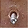
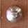
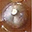
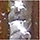
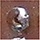

# Soldas DT Aug

Este projeto é destinado a geração de uma base de imagens utilizando data Augmentation a partir de 5 imagens de solda. Estas imagens serão submetidas a transformações tradicionais e transformações complexas com o proposito de enriquecer a consistencia da base e consequentimente refinar a classificação de futuras soldas.

## Imagens iniciais

## Geração

Ao executar o arquivo [main.py](main.py) o Dataset será gerado na pasta [dist](dist)

## Transformações
### Transformações tradicionais

- Rotation
- Flip

### Transfomações complexas